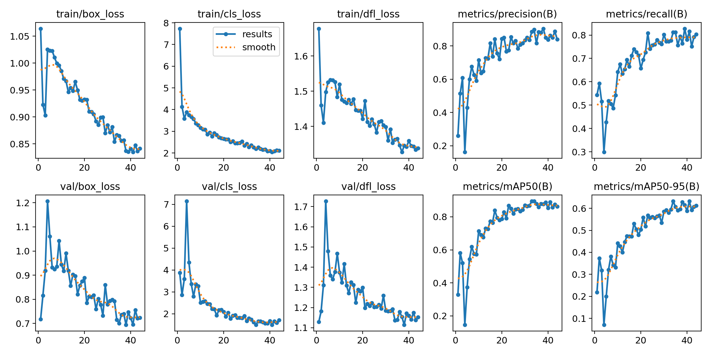
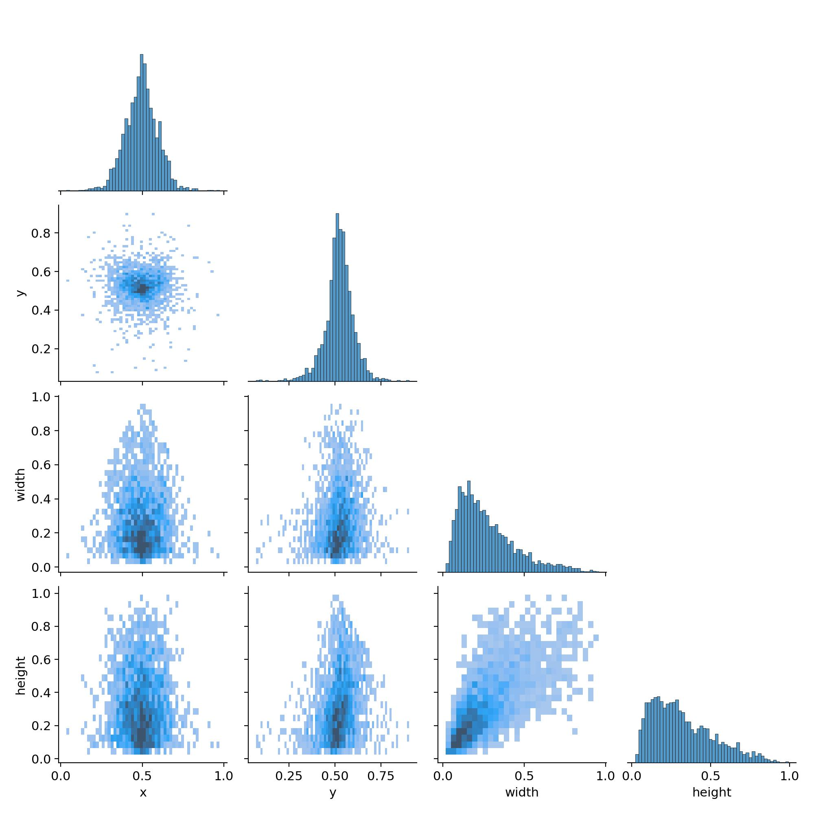
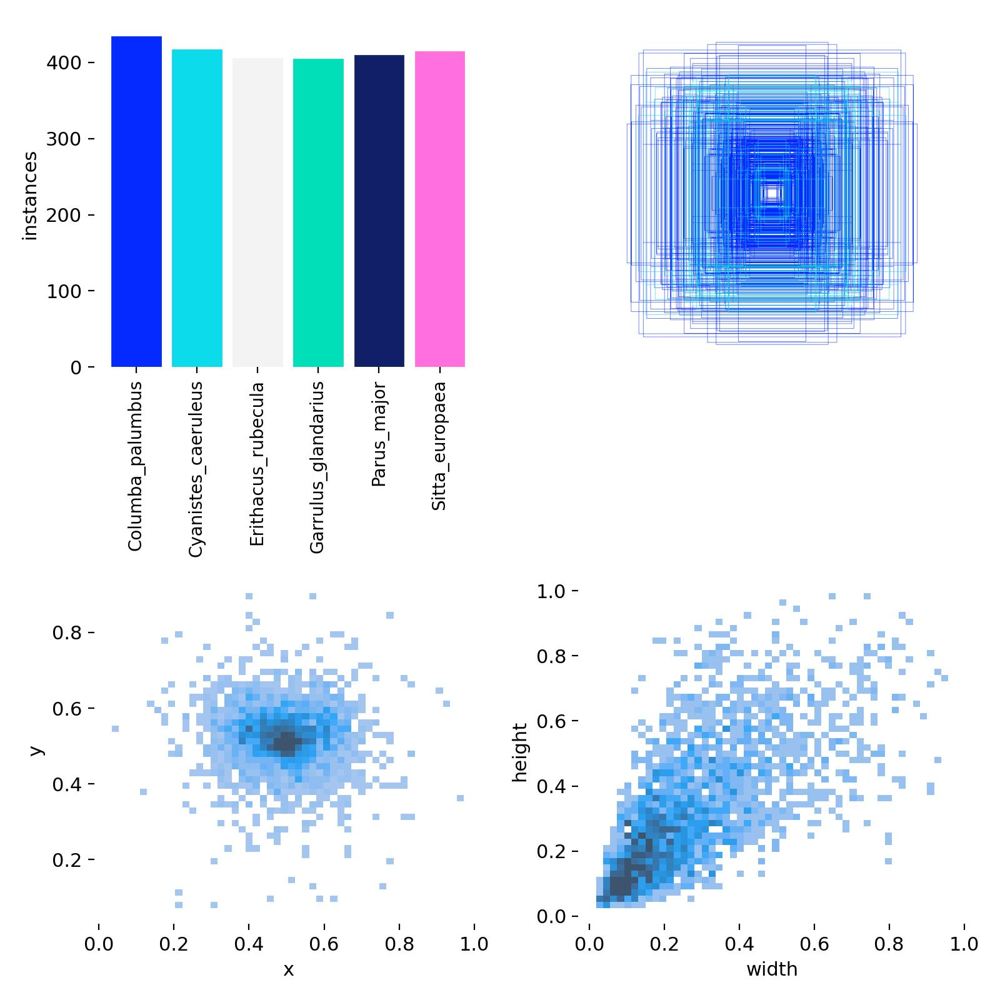

# WatchMyBirds-Train-YOLO

This dataset from [**WatchMyBirds-Data**](https://github.com/arminfabritzek/WatchMyBirds-Data)
was used to train the model for [**WatchMyBirds**](https://github.com/arminfabritzek/WatchMyBirds).

The best model is available under best_model/weights/best.pt
[**BEST MODEL**](best_model/weights/best.pt)

The model was trained on 27 classes using a balanced dataset, where only species with between 400 and 470 images were included.

---

**Training Data:**

---

**Training Statistics:**
---

---

---  

---  
